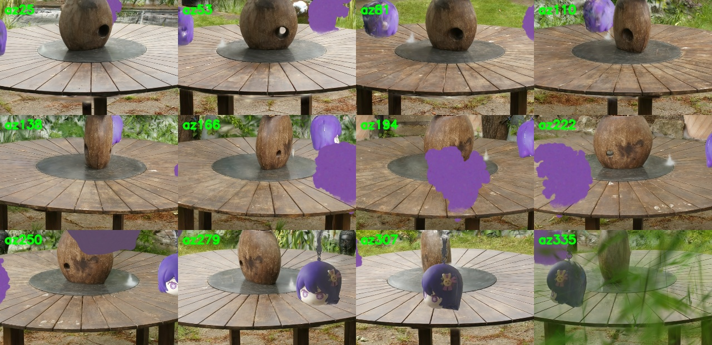

# DL_Final — 基于 3DGS 与 AIGC 的多源资产生成与真实场景融合

深度学习与空间智能 期末作业 **题目一**。用三种不同技术各生成一个 3D 物体、重建一个真实背景场景、
并将三者融合到同一 3D 场景中做多角度漫游渲染，最后对比三种生成路线的几何/纹理/耗时差异。

> 最终融合漫游视频：`report_materials/fusion/fusion_garden_final.mp4`
> 报告素材（方法/超参/指标/对比/成因分析）：`report_materials/REPORT_NOTES.md`



---

## 1. 流水线总览

| 物体 | 技术路线 | 关键脚本 |
|---|---|---|
| **A** 真实多视角重建 | 手机环绕视频 → COLMAP 位姿 → **3D Gaussian Splatting** | `scripts/wsl/run_a_30k.sh` → `crop_a_geometric.py` |
| **B** 文本→3D | **threestudio DreamFusion** + Stable Diffusion v1.5 + **SDS Loss** | `scripts/wsl/run_b_v2.sh` |
| **C** 单图→3D | 单张照片 → **SAM3** 抠前景 → **Stable Zero123** | `scripts/segment_c_with_sam3.py` → `scripts/wsl/run_c_1000.sh` |
| **背景** | Mip-NeRF 360 `garden` → **3DGS** | `scripts/wsl/run_bg_garden_30k.sh` |
| **融合 & 渲染** | mesh→高斯统一 + 解析平滑轨道（反求训练几何，避免拖影） | `compose_garden.py` → `render_scene_from_cameras.py` |

物体统一为同一角色（紫发娃娃头挂件：星星眼、吐舌、兔子发夹），便于横向对比。

## 2. 目录结构

```
scripts/
  preprocess_assets.ps1          # 抽取 A 帧、准备 C 输入
  segment_c_with_sam3.py         # C 前景抠图（SAM3）
  crop_a_geometric.py            # A 的 3DGS 几何裁剪（保留全部颜色，去背景）
  compose_scene.py               # PLY/OBJ I/O + 纹理网格表面采样（被下游 import）
  compose_gaussian_scene.py      # 高斯 PLY 读写 + mesh→高斯 工具（被下游 import）
  compose_garden.py              # 把 A(高斯)+B/C(mesh→surfel 高斯) 融合到 garden 背景
  render_scene_from_cameras.py   # 最终渲染器：反求训练相机几何 → 平滑解析轨道 + H.264
  render_object_orbit.py         # 单物体环绕渲染（资产验证用）
  upload_tb_scalars_to_wandb.py  # 把 3DGS 的 TensorBoard 曲线上传到 W&B
  wsl/                           # 各阶段的运行脚本（在 WSL 内调用 COLMAP/3DGS/threestudio）
prompts/object_b_v2_prompt.txt   # 物体 B 的文本提示词（去 keychain、head-only、anti-Janus）
report_materials/                # 报告素材：最终视频、contact sheets、W&B 曲线
```


## 3. 环境

详见 [`ENVIRONMENT.md`](ENVIRONMENT.md)。硬件：单卡 RTX 4080 SUPER 32GB；系统：Windows 11 + WSL Ubuntu 24.04。
三个互不冲突的 conda 环境（GPU 环境共用 torch 2.1.2+cu118 / CUDA 11.8）：

- `hw3-colmap`：COLMAP 4.0.4（A 的 SfM 位姿）
- `hw3-3d`：[graphdeco-inria/gaussian-splatting](https://github.com/graphdeco-inria/gaussian-splatting)（3DGS 训练 + 可微光栅化）
- `hw3-threestudio`：[threestudio-project/threestudio](https://github.com/threestudio-project/threestudio)（DreamFusion / Stable Zero123）

辅助脚本依赖见 [`requirements.txt`](requirements.txt)（numpy / opencv / pillow / tensorboard / wandb）。

## 4. 复现步骤（Train / Test）

> 脚本里的绝对路径是作者的 WSL 环境（`/home/xundaoying/...`、`/mnt/d/...`），复现时按需修改。
> 每个脚本把参数烤进文件（避免 MINGW→WSL 传参丢失），运行状态/耗时会追加到本地实验日志。

```bash
# 0) 数据准备
powershell -File scripts/preprocess_assets.ps1 -FrameFps 3 -FrameWidth 1280   # 抽 A 帧 + C 输入
bash scripts/wsl/download_garden.sh                                            # 国内镜像拉 garden(images_4+sparse)，零 VPN
python scripts/segment_c_with_sam3.py --sam3-root <SAM3> --checkpoint <sam3.pt> \
       --prompt 'anime doll head keychain' --threshold 0.15                    # C 前景抠图

# 1) 物体 A：COLMAP + 3DGS(30k) + 几何裁剪
bash scripts/wsl/run_a_30k.sh
python scripts/crop_a_geometric.py --input <A_30k>/point_cloud/iteration_30000/point_cloud.ply \
       --radius-multiplier 2.0 --max-radius 2.2 --min-voxel-count 4 \
       --out-ply outputs/A_30k_crop/point_cloud.ply --metadata outputs/A_30k_crop/meta.json

# 2) 背景 garden：3DGS(30k)
bash scripts/wsl/run_bg_garden_30k.sh

# 3) 物体 B：文本→3D（threestudio DreamFusion，4000 步）
bash scripts/wsl/run_b_v2.sh

# 4) 物体 C：单图→3D（Stable Zero123，1000 步）
bash scripts/wsl/run_c_1000.sh

# 5) 融合 + 渲染（解析平滑轨道，自动转 H.264）
python scripts/compose_garden.py --bg-ply <garden>.ply --bg-model-dir <garden_dir> \
       --a-ply outputs/A_30k_crop/point_cloud.ply \
       --b-obj <B>/it4000-export/model.obj --b-texture <B>/.../texture_kd.jpg \
       --c-obj <C>/it1000-export/model.obj --c-texture <C>/.../texture_kd.jpg \
       --out-dir outputs/fusion --layout ring --ring-radius 1.0 --face-outward \
       --table-y 1.2 --object-size 0.6 --a-size-mult 1.4
python scripts/render_scene_from_cameras.py --model outputs/fusion/model \
       --cameras outputs/fusion/model/cameras.json --smooth-orbit --orbit-frames 300 \
       --orbit-arc 310 --orbit-start 25 --aim-drop 0.05 --orbit-radius-scale 1.8 \
       --out-width 1000 --fps 30 --h264 --out-dir outputs/fusion/orbit --video-name final.mp4
```
